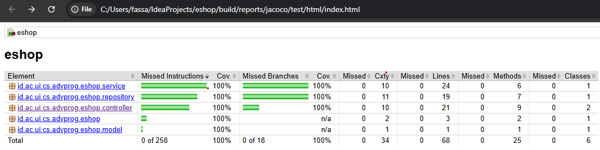

# **Advance Programming Tutorial**

## **Nama**: Faiz Assabil Firdaus
## **NPM**: 2306224354
## **Kelas**: B

---

## **Reflection**
### **List of Modules**
1. [**Module 1** - Coding Standards](#module-1)
2. [**Module 2** - CI/CD & DevOps](#module-2)

---

## **Module 1**
### **Reflection 1.1**

Dalam mengembangkan aplikasi ini menggunakan **Spring Boot**, saya telah menerapkan beberapa prinsip **Clean Code** dan **Secure Coding Practices** untuk memastikan kode saya bersih, aman, dan mudah dikelola.

---

### **Clean Code Principles Applied**

1. **Meaningful Names**
   - Variabel, metode, dan kelas menggunakan nama yang deskriptif dan mudah dipahami tanpa perlu banyak komentar tambahan.
   - Contoh: `ProductController`, `ProductService`, `findById(String id)`, yang semuanya menjelaskan fungsinya dengan jelas.

2. **Single Responsibility Principle (SRP)**
   - Setiap kelas hanya memiliki satu tanggung jawab utama.
   - `ProductController` menangani request-response.
   - `ProductServiceImpl` menangani business logic.
   - `ProductRepository` menangani penyimpanan data.

3. **DRY (Don't Repeat Yourself)**
   - Business logic dipisahkan ke `ProductServiceImpl`, sehingga `ProductController` tidak memiliki kode yang duplikatif.

4. **Consistent Formatting**
   - Struktur kode rapi dan menggunakan konvensi Java yang standar, termasuk indentation yang seragam.

5. **Proper Use of HTTP Methods**
   - Endpoint menggunakan metode yang sesuai:
      - `GET` untuk mendapatkan data (`/product/list`, `/product/edit/{id}`)
      - `POST` untuk operasi create dan update (`/product/create`, `/product/edit`)
      - `GET` untuk delete (`/product/delete/{id}`)

6. **Code Modularity**
   - Kode dipisahkan berdasarkan tanggung jawabnya dalam controller, service, repository, dan model.

---

### **Secure Coding Practices Applied**

1. **Input Validation**
   - **Saat ini belum ada validasi input**, sehingga perlu ditambahkan agar:
      - Nama produk tidak boleh kosong.
      - Kuantitas harus berupa angka positif.
   - Bisa menggunakan **Spring Validator** atau anotasi `@Valid`.

2. **Proper Exception Handling**
   - Saat ini, jika produk tidak ditemukan dalam `findById()`, aplikasi mengembalikan `null`, yang bisa menyebabkan error.
   - **Perbaikan:**
      - Gunakan `Optional<Product>` di repository agar lebih aman.
      - Jika produk tidak ditemukan, sebaiknya lemparkan `ProductNotFoundException`.

3. **Preventing CSRF Attacks**
   - **Spring Security** perlu diaktifkan untuk mencegah serangan CSRF.

4. **Feedback to User**
   - Setelah operasi seperti **create, edit, atau delete**, sebaiknya menggunakan **RedirectAttributes** untuk menampilkan pesan sukses/gagal ke pengguna.

5. **Improved Error Messages**
   - Jika terjadi kesalahan seperti produk tidak ditemukan, sebaiknya tampilkan halaman error khusus yang lebih user-friendly daripada **Whitelabel Error Page**.

---

### **Areas for Improvement**

1. **Tambah Validasi Input**
   - Gunakan anotasi `@Valid` dengan `@Size`, `@NotNull`, atau custom validation.

2. **Gunakan Exception Handling yang Lebih Baik**
   - Implementasikan `ProductNotFoundException` agar error handling lebih informatif.

3. **Perbaiki Error Page untuk User Experience yang Lebih Baik**
   - Gunakan **Thymeleaf Error Handling** agar halaman error lebih jelas bagi pengguna.

4. **Implementasikan Spring Security untuk Perlindungan Lebih Lanjut**
   - Aktifkan CSRF protection dan tambahkan autentikasi jika aplikasi berkembang lebih lanjut.

---

### **Reflection 1.2**

### **Perasaan Setelah Menulis Unit Test**
Setelah menulis unit test, saya lebih yakin terhadap kestabilan kode. Unit test membantu menangkap bug lebih awal dan memastikan fitur utama berfungsi dengan baik.

### **Jumlah Unit Test yang Dibutuhkan**
Unit test harus mencakup:
1. **Happy path** (penggunaan normal)
2. **Negative cases** (input tidak valid)
3. **Boundary cases** (nilai batas)

Di `ProductRepositoryTest`, saya menguji **create, find, update, dan delete**, yang cukup untuk memastikan repository bekerja dengan baik.

### **Menentukan Kecukupan Unit Test**
Gunakan **JaCoCo** untuk melihat seberapa banyak kode yang diuji. Namun, **100% coverage tidak menjamin kode bebas bug**, karena masih bisa ada edge case yang tidak diuji. Target **80% coverage** umumnya cukup, dengan sisanya diuji melalui integration test.

---

### **Refleksi Functional Testing & Clean Code**
Functional test awalnya mengandung duplikasi dalam setup dan pengujian CRUD.

#### **Perbaikan yang Dilakukan**
1. **Pemisahan Functional Test untuk Modul yang Berbeda**
   - `CreateProductFunctionalTest.java` hanya menguji fitur **Create Product**.
   - `ProductFunctionalTest.java` menangani **Edit** dan **Delete**.
   - **Manfaat:**
      - Mengurangi kompleksitas dalam satu file.
      - Lebih mudah diperbarui jika ada perubahan dalam UI atau logika.

2. **Duplikasi Setup Dihindari**
   - Sebelum perbaikan, setiap test suite mengulang setup untuk **base URL** dan **ChromeDriver**.
   - Solusi:
      - Menggunakan `@BeforeEach` untuk setup yang sama di setiap test suite.

3. **Penghapusan Redundansi dalam Functional Test**
   - Tes jumlah produk tidak perlu dibuat dalam file baru.
   - Sekarang, pengecekan jumlah produk dilakukan dalam `ProductFunctionalTest.java`.

4. **Menggunakan XPath yang Spesifik untuk Edit dan Delete**
   - Sebelumnya, tes `deleteProduct_isSuccessful()` bisa saja menghapus produk yang salah karena tombol Delete pertama yang ditemukan diklik.
   - Solusi:
      - Cari **baris tabel yang memiliki nama produk tertentu** sebelum menekan tombol Delete.
      - Sekarang, test akan mencari produk dengan `//tr[td[contains(text(),'Produk Hapus')]]` sebelum menghapusnya.

---

## **Module 2**
Link Deployment: https://diverse-jenelle-fassabilf-60f284af.koyeb.app/
### **1. Perbaikan Kualitas Kode**
Selama latihan ini, saya melakukan beberapa perbaikan pada kode untuk meningkatkan kualitasnya, terutama berdasarkan hasil analisis **PMD** dan **pengujian unit test**:
- **Unit test diperbaiki hingga 100% coverage** untuk memastikan semua bagian kode diuji dengan baik.
- **Return dari controller disesuaikan** agar lebih konsisten dan menghindari error yang tidak terdeteksi.
- **Masalah yang diindikasi oleh PMD diselesaikan**, termasuk:
    - Menghapus **import yang tidak digunakan**.
    - Menghilangkan **modifier yang tidak perlu dalam interface**.
    - Memastikan **setiap class memiliki konstruktor yang sesuai** jika bersifat utility.

Perbaikan ini memastikan kode lebih bersih, aman, dan sesuai dengan standar yang baik.

---

### **2. Evaluasi CI/CD**
Implementasi **CI/CD sudah sesuai** dengan prinsip **Continuous Integration** dan **Continuous Deployment** karena mencakup **4 workflow utama**:
1. **Unit test** dijalankan secara otomatis untuk memverifikasi bahwa semua kode tetap berfungsi dengan baik.
2. **Analisis PMD** dilakukan untuk menjaga standar kualitas kode dan mendeteksi potensi masalah.
3. **OSSF Scorecard** digunakan untuk mengevaluasi tingkat keamanan dan keandalan proyek berdasarkan best practices open source.
4. **Continuous Deployment menggunakan Koyeb**, sehingga setiap perubahan yang telah melewati CI dapat langsung dideploy ke server tanpa perlu intervensi manual.

Dengan pipeline ini, setiap perubahan kode diuji dan dideploy secara otomatis, sehingga pengembangan lebih **efisien**, **cepat**, dan **terpercaya**.

---
Bonus Coverage 100%:
